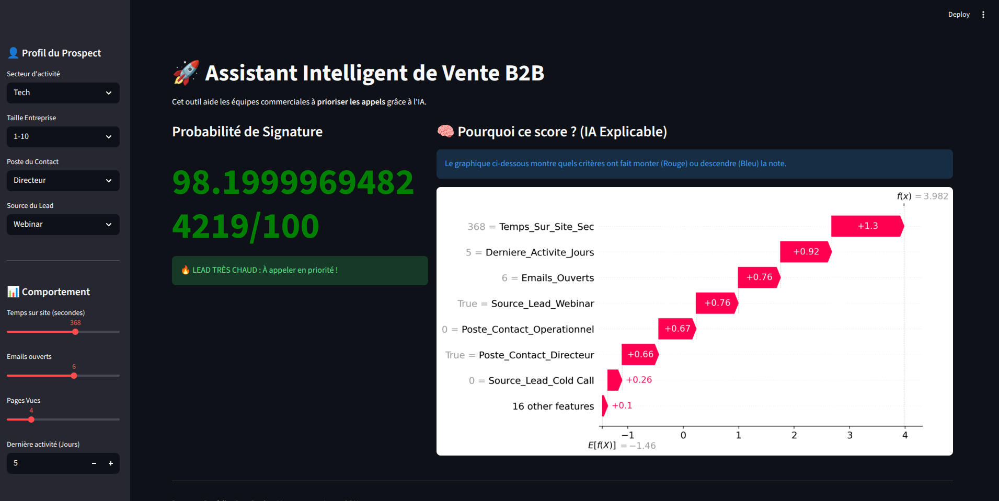
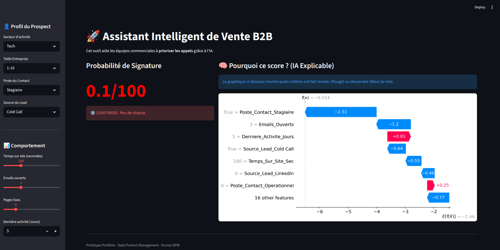

# 🚀 B2B Predictive Lead Scoring | Moteur de Scoring Commercial par l'IA 🟢 Live App

> *🇺🇸 An Explainable AI (XAI) scoring engine designed to prioritize B2B sales leads and reduce CAC.*
> *🇫🇷 Un moteur de scoring prédictif basé sur l'IA explicable (SHAP) pour prioriser les prospects commerciaux.*

[](https://lead-scoring-portofolio-ofk.streamlit.app/)





## 📋 Contexte & Problème Business
Les équipes commerciales B2B perdent jusqu'à **40% de leur temps** à traiter des prospects froids ou mal qualifiés. Le pilotage "au feeling" entraîne une perte d'efficacité et un coût d'acquisition client (CAC) élevé.

**La Solution :** Une application de **Scoring Prédictif** qui permet de :
1.  **Prioriser** les leads ayant la plus forte probabilité de signature.
2.  **Expliquer** les raisons du score grâce à l'IA explicable (XAI).
3.  **Guider** l'action commerciale (Appel immédiat vs Nurturing).

👉 **[Testez l'application en live ici](https://lead-scoring-portofolio-ofk.streamlit.app/)**

---

## 🧠 Fonctionnalités Clés (Product Features)

### 1. Scoring en Temps Réel
Calcul instantané d'un score de conversion (0-100%) basé sur les données firmographiques (Taille, Secteur) et comportementales (Engagement web, Emails).

### 2. IA Explicable ("White Box")
Contrairement aux algorithmes "boîte noire", cet outil utilise **SHAP (SHapley Additive exPlanations)** pour détailler l'impact de chaque critère.
* *Exemple :* "+15 points car le contact est un Directeur", "-5 points car aucune activité depuis 30 jours".

### 3. Interface d'Aide à la Décision
Un code couleur simple (Vert/Orange/Rouge) et des recommandations d'actions pour faciliter l'adoption par les équipes de vente.

---

## 🛠️ Stack Technique

* **Langage :** Python 3.10
* **Machine Learning :** XGBoost (Gradient Boosting) pour la performance sur données tabulaires.
* **Interprétabilité :** SHAP (Game Theoretic approach).
* **Frontend :** Streamlit (Déploiement rapide d'app Data).
* **Data Processing :** Pandas, NumPy.

---

## 📊 Performance du Modèle
Le modèle a été entraîné sur un dataset synthétique simulant un pipeline de vente SaaS B2B (2000 prospects).

* **Accuracy (Précision globale) :** 89%
* **Precision (Classe "Signé") :** 79% (Minimise les faux positifs pour ne pas faire perdre de temps aux vendeurs).

---

## 💻 Installation Locale

Si vous souhaitez faire tourner le projet sur votre machine :

```bash
# 1. Cloner le repository
git clone [https://github.com/VOTRE_NOM/lead-scoring-portfolio.git](https://github.com/VOTRE_NOM/lead-scoring-portfolio.git)
cd lead-scoring-portfolio

# 2. Installer les dépendances
pip install -r requirements.txt

# 3. Lancer l'application
streamlit run app.py
